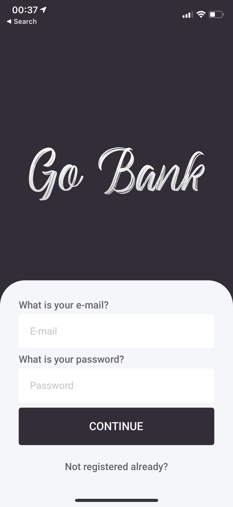
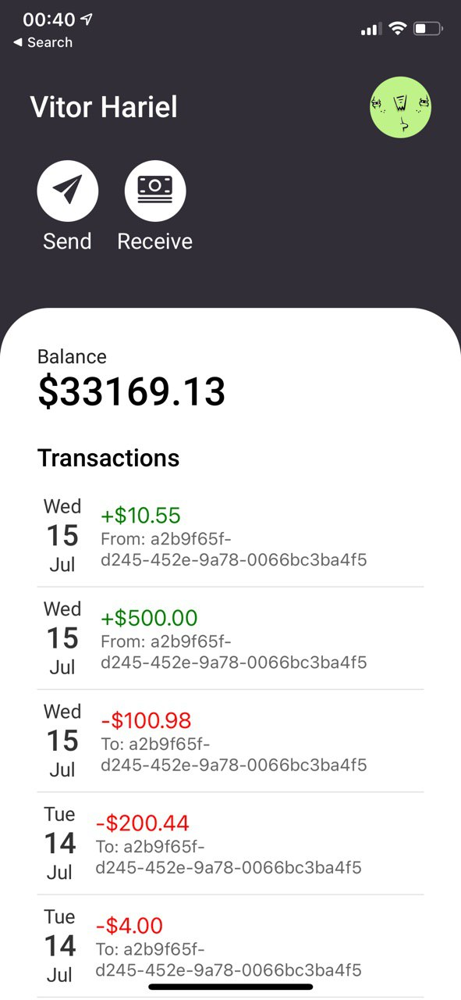
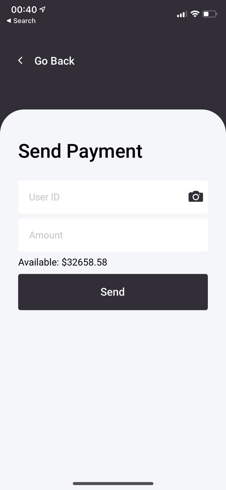

> A banking APP created with React Native and Expo

# What is it?

GoBank is an app made with React Native. It mocks up a bank or payment app and uses its own REST API to serve all the data. Users can create their own accounts, see their transactions, receive and send payments.

# Technolgy Used

* Expo
* React Navigation
* Axios
* Formik
* Yup
* Lottie
* Styled Components

# TODO
- [ ] Notifications
  - [ ] In-app notifications center
  - [ ] Push notifications
- [ ] Screens
  - [ ] Email verification
  - [ ] Failed payment
  - [ ] Profile
- [ ] Transactions
  - [ ] Filter per date

# For Developers

1. Have a React Native ready environment or set up one [here](https://reactnative.dev/docs/environment-setup).
2. Clone the project using `https://github.com/vitorhariel/gobank.git`
3. Install the dependencies with `npm install`
4. Run it with `expo start`